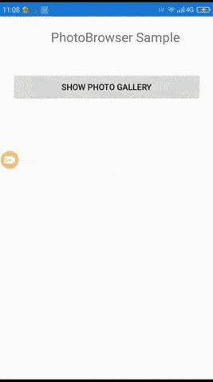

# PhotoBrowser.Forms

Full screen image viewer(Xamarin.Forms) that includes "pinch to zoom" and "swipe to dismiss" gestures.

[](https://www.nuget.org/packages/PhotoBrowser.Forms/)

Supports Android and iOS.
* Android library from : https://github.com/stfalcon-studio/FrescoImageViewer
* iOS library from : https://github.com/mwaterfall/MWPhotoBrowser

## Features

* Pinch to zoom.
* Swipe to dismiss.
* Custom Title.
* Custom Action Button.

## Screen-Shots

 

## Setup

* Install the [nuget package](https://www.nuget.org/packages/PhotoBrowser.Forms) in portable and all platform specific projects.

### Android

In MainActivity.cs file

```cs
    Stormlion.PhotoBrowser.Droid.Platform.Init(this);
```

### iOS

In AppDelegate.cs file

```cs
    Stormlion.PhotoBrowser.iOS.Platform.Init();
```
## Usage

```cs
    new PhotoBrowser
    {
        Photos = new List<Photo>
        {
            new Photo
            {
                URL = "https://raw.githubusercontent.com/stfalcon-studio/FrescoImageViewer/v.0.5.0/images/posters/Vincent.jpg",
                Title = "Vincent"
            },
            new Photo
            {
                URL = "https://raw.githubusercontent.com/stfalcon-studio/FrescoImageViewer/v.0.5.0/images/posters/Jules.jpg",
                Title = "Jules"
            },
            new Photo
            {
                URL = "https://raw.githubusercontent.com/stfalcon-studio/FrescoImageViewer/v.0.5.0/images/posters/Korben.jpg",
                Title = "Korben"
            }
        },
        ActionButtonPressed = (index) =>
        {
            Debug.WriteLine($"Clicked {index}");
        },
		
		BackgroundColor = Color.White,
		DidDisplayPhoto = (index) =>
		{
			Debug.WriteLine($"Selection changed: {index}");
		},

		Android_ContainerPaddingPx = 20,
		iOS_ZoomPhotosToFill = false		
    }.Show();
```

### More Properties
* ActionButtonPressed
* StartIndex

## Contributions
Contributions are welcome!
